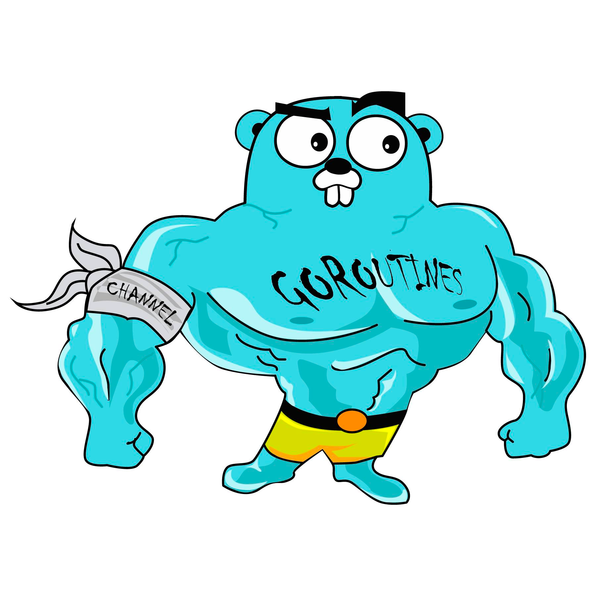

# Feed Consumer
## Task description
This task is based on a common business task we have within the backend team. We have a number of microservices that process data from external feed providers. This allows us to transform the data into a consistent and desirable format that the app developers can consume. It also provides stability so that, as is often the case, when the external provider has issues we can still provide data to the apps, albeit stale data.

The project must meet the following requirements:
Be written in Golang - https://golang.org/doc/ - 
Use MongoDB to store news articles - (https://www.mongodb.com/download-center/community)
At regular intervals, poll the endpoint for new news articles
Transform the XML feeds of news articles into appropriate model(s) and save them in the database
Provide two REST endpoints which return JSON:
Retrieve a list of all articles
Retrieve a single article by ID
Comments where appropriate
Send over README file listing what works and what doesn't - as well as instructions (if any) on how to run

## Solution notes
- :trident: clean architecture (handler->service->repository)
- :book: standard Go project layout (well, more or less :blush:)
- :arrows_counterclockwise: REST API
- :whale: dockerized + docker-composed
- ❤️ Swagger auto-generated on make generate included
- :elephant: MongoDB

##What is contained
1. Created GetAllNews and GetNewsByID endpoints
2. Connection with MongoDb
3. Graceful shutdown
4. Swagger for all endpoints
5. Docker Compose file
6. Make file
7. Log Handler implemented

##Nice to have
1. Unit tests
2. E2E tests
3. Authentication by token
4. Library for working with mongoDB

##How to run this application:
1. Start docker
2. make run

